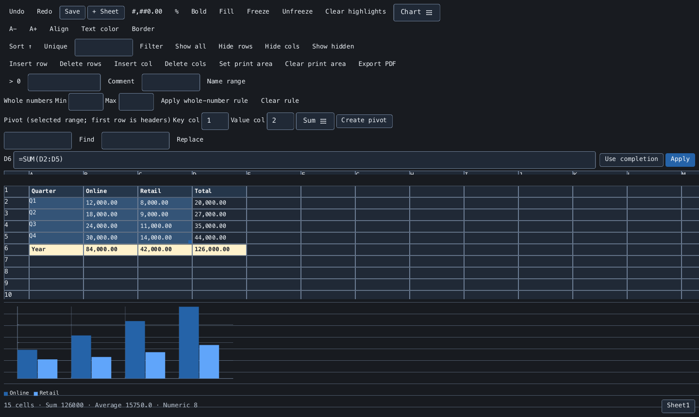

<h1 align="center">Rukbat</h1>

<p align="center">
  <strong>A Ruby spreadsheet editor with sparse sheets, live formulas, and CSV/TSV workflows.</strong>
</p>

<p align="center">
  <a href="https://rubygems.org/gems/rukbat"></a>
  <a href="https://rubygems.org/gems/rukbat"></a>
  <a href="https://github.com/noxdea/rukbat/actions/workflows/main.yml"></a>
  <a href="rukbat.gemspec"></a>
  <a href="LICENSE.txt"></a>
</p>

<p align="center">
  <a href="https://noxdea.github.io/rukbat/">Website</a> ·
  <a href="https://noxdea.github.io/rukbat/docs/">User Guide</a> ·
  <a href="#features">Features</a> ·
  <a href="#installation">Installation</a> ·
  <a href="#quick-start">Quick start</a>
</p>

---

Rukbat opens CSV and TSV files in a desktop editor or an interactive terminal,
with live formulas, range summaries, and charts. The same workbook is available
as a Ruby API. It combines [Denebola](https://github.com/noxdea/denebola)'s
persistent sparse sheets with [Furud](https://github.com/noxdea/furud)'s formula
engine and [Zaniah](https://github.com/noxdea/zaniah)'s interface.

[](https://noxdea.github.io/rukbat/docs/usage.html)

## Features

- Edit a virtualized million-row grid with inline editing, formula completion, multi-sheet references, and range summaries.
- Undo and redo edits; insert, delete, hide, and freeze rows and columns.
- Format cells, sort and filter ranges, remove duplicate rows, and find or replace text.
- Add comments, named ranges, conditional highlights, and whole-number input rules.
- Create static Sum or Count pivots and line, bar, pie, donut, scatter, area, or stacked charts.
- Import CSV/TSV with encoding detection, export UTF-8 data, and produce searchable PDFs with an embedded font.
- Use the workbook directly from Ruby without opening an editor.

## Installation

Rukbat requires **Ruby 3.2 or newer**. Install the released gem:

```sh
gem install rukbat
rukbat --version
```

Or add `gem "rukbat"` to your Gemfile. The editor needs a supported desktop
session or an interactive terminal. Rukbat selects native windows on macOS and
Windows; on Linux, it selects a desktop when display variables are set and
otherwise uses an interactive terminal. The workbook API and command-line PDF
export work without a window.

## Quick start

Open an existing CSV, start an empty workbook at a new path, or use TSV:

```sh
rukbat sales.csv
rukbat new.csv
rukbat data.tsv
rukbat --tsv data.txt
```

Select cells with the mouse or arrow keys. Double-click or press Enter to edit
in place; Enter commits and Escape cancels. To edit through the formula bar,
enter a value or formula and choose **Apply**.

For a first calculation, enter `12` in A1, `30` in A2, and `=SUM(A1:A2)` in B1.
B1 displays `42` and updates when an input changes. Select A1:A2 to see its
count, numeric count, sum, and average in the status bar.

Choose **Save** or press Ctrl+S (Cmd+S on macOS). Ctrl+Z / Cmd+Z undoes workbook
changes; Ctrl+Shift+Z / Cmd+Shift+Z redoes them. Run `rukbat --help` for all CLI
options, or follow the [getting started guide](https://noxdea.github.io/rukbat/docs/).

## Workbook API

Coordinates are one-based. Read calculated values with `[]`, and stored
expressions with `input_at`:

```ruby
require "rukbat"

book = Rukbat::Workbook.new
book.set(1, 1, 12)
book.set(2, 1, 30)
book.set(1, 2, "=SUM(A1:A2)")
book[1, 2]          # => 42
book.input_at(1, 2) # => "=SUM(A1:A2)"

book.add_sheet("Annual Plan")
book.set(1, 1, 2026, sheet: "Annual Plan")
book.undo
book.redo
```

See the [workbook API guide](https://noxdea.github.io/rukbat/docs/workbook-api.html)
for batch edits, formatting, validation, pivots, and file operations.

## Files and limits

**CSV/TSV saves only the active sheet, with calculated formula values by
default.** Other sheets, formatting, comments, named ranges, validation,
charts, and undo history are not stored. Use `values: :input` in the Ruby API
to export formula expressions. A loaded file's save checks for external changes.

```ruby
book = Rukbat::CSVFile.read("sales.csv", hint: "Windows-31J")
Rukbat::CSVFile.write(book, "sales-export.csv")
Rukbat::CSVFile.write(book, "formulas.tsv", delimiter: :tsv, values: :input)
```

Export a PDF without opening the editor:

```sh
rukbat --export-pdf report.pdf --font /path/to/font.ttf sales.csv
```

PDFs retain searchable text and cell formatting, but do not render charts.
The editor's print area limits PDF output for the current session. Pivot tables
are static snapshots; activate the pivot sheet before saving its summary.

Workbooks support 1,048,576 rows and 16,384 columns. CSV/TSV export is limited
to 10 million cells; PDF export to 100,000 cells. Rukbat does not open or save
XLSX/ODS. See [files, exports, and limits](https://noxdea.github.io/rukbat/docs/files.html)
for preservation details, operation limits, and troubleshooting.

## Documentation

- [User Guide](https://noxdea.github.io/rukbat/docs/)
- [Using the editor](https://noxdea.github.io/rukbat/docs/usage.html)
- [Formulas and references](https://noxdea.github.io/rukbat/docs/formulas.html)
- [Files, exports, and limits](https://noxdea.github.io/rukbat/docs/files.html)
- [Workbook API](https://noxdea.github.io/rukbat/docs/workbook-api.html)
- [Development](https://noxdea.github.io/rukbat/docs/development.html)
- [Changelog](CHANGELOG.md)

## Development

```sh
bundle install
bundle exec rake spec
BUDGET=1 bundle exec rake bench
bundle exec rbs -I sig -I "$(bundle info --path furud)/sig" -I "$(bundle info --path denebola)/sig" validate
gem build --strict rukbat.gemspec
```

Issues and pull requests are welcome on [GitHub](https://github.com/noxdea/rukbat).
See the [development guide](https://noxdea.github.io/rukbat/docs/development.html)
for the component overview and website preview instructions.

## License

Rukbat is released under the [MIT License](LICENSE.txt).
Its name comes from Rukbat (α Sagittarii), Arabic *rukbat al-rāmī*
(“the archer’s knee”).
